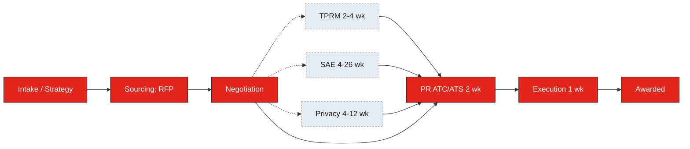

<!-- SHARED-BLOCK:START (generated; do not hand-edit) -->
> **Suite:** v10.6.6
>
> **Troubleshooting and usage guidance (inlined below):** If the user asks how to use this skill, what output to expect, which model to use (Opus vs Sonnet), or reports an error, answer from this inline note. (The shared `lilly-brand-assets-1c344a` user manual is the fuller reference when that foundation is installed; this skill never hard-depends on it.) Common cases: (a) **diagram looks wrong / too generic** - the skill ran without process-navigator and timeline-builder reachable, so phases and durations are inferred defaults labeled "Inferred, not policy-verified"; run inside the suite Project so those siblings are callable, or provide the request document. (b) **owners all show `[OWNER?]`** - no Field Guide state or case file carried a roster; answer the single batched owners question or paste the state JSON. (c) **email diagram does not render in Outlook** - the recipient is on a client that strips inline SVG; the labeled ASCII plain-text fallback under the SVG (plus the SVG alt text) is the safe degrade, do not delete it for unknown recipients. (d) **which model** - Opus for the full map and phase reasoning; Sonnet is fine for a quick re-render of an already-determined phase set. This skill is chat-first by default; React/dashboard/share-button errors apply only to the optional artifact mode, not to in-chat or email output.

## GLOBAL OPERATING RULES (apply to every run of this skill)

These rules govern HOW this skill behaves. They are shared across all Lilly procurement skills so the suite feels like one system. This skill must work for ALL categories and commodities (IT, professional services, lab, clinical, chemicals, equipment, facilities, logistics, marketing, and more), never IT alone.

**1. Minimize what the user must provide.**
- Do the heavy lifting from whatever is given. Never make the user pre-structure or pre-clean inputs.
- Prefer DEFAULT-AND-OVERRIDE to asking.
- Handle messy, partial, or unstructured inputs.

**2. Ask rarely, and only when a wrong guess is expensive.**
- Default to proceeding with clearly labeled assumptions.
- ASK only when a wrong assumption creates exposure.
- When you must ask, batch it: 1 to 3 questions maximum, asked once.
- Render every ENUMERABLE choice as tappable options via `ask_user_input_v0`, with the most likely option pre-selected.

**3. Stay category-neutral and honest about confidence.**
- For categories OUTSIDE strong knowledge, do NOT fabricate; label inferences explicitly; signal confidence High/Medium/Low.

**4. Deliver decision-ready output in THIS skill's native format.**
- Every recommended action states what to do, why it matters, and where applicable impact and effort.

**5. Run a proportional completeness check before finalizing.**

**6. End with brief Next Steps.**

**7. Never use em dashes. (HARD RULE, suite-wide.)** Restructure with hyphens, colons, parentheses, or separate sentences.

**8. Deliverable structure is deterministic.** (HARD RULE) Same inputs produce the same diagram skeleton and checklist columns. Only the present phases render; missing phases are omitted, not blanked. Checklist columns are fixed at task / owner / depends-on / due-loose / status.

**9. Follow the Execution Guardrails. (HARD RULE, suite-wide.)**
- The cross-skill guardrails G1-G10 are summarized inline below, so this skill is self-sufficient. When the shared `lilly-brand-assets-1c344a` foundation (v10.0+) is installed, its `execution-guardrails` text is the fuller canonical version; defer to it when present, but never hard-depend on it.
- **Foundation dependency / graceful degradation:** the canonical brand references (palette, house styles, dashboard components, user manual) live inside the `lilly-brand-assets` skill. If that foundation cannot be read (missing, corrupted, or older than expected), do NOT fail: proceed using the inlined palette and house-style summary in Step 4, tell the user you are running without the shared references (so styling may be reduced), and ask them to confirm lilly-brand-assets v10.0+ is installed.
- **Relevant guardrails for this skill (G1-G10 summary):** G2 gate checks (determine phases and roster before drawing); G5 data-model-first (assemble the phase list and checklist rows as data before rendering any SVG/HTML); G6 pre-delivery self-test (run the Step 4/5 integrity check below before emitting); G9 anti-collapse (for this skill the collapse patterns are: a parallel review branch that does not re-converge, an invented review not returned by process-navigator, a hard calendar date, or a duration that contradicts timeline-builder; if any appears, stop and re-derive); G10 chunked-artifact-assembly (for a large single-file diagram/artifact, scaffold it first, append section by section, and run the Step 4/5 structural self-test before emitting). The remaining guardrails (G1 tool selection, G3 existing-context-first, G4 definition tracing, G7 research minimums, G8 pass-artifact enforcement) apply as written in the foundation when relevant to a run.

**Inlined house-style summary (referenced by Rule 9; this skill is self-sufficient without the foundation).** This skill uses the **Magazine-Report** house style for artifact mode. Pull exact palette and typography from the foundation's brand-colors / dashboard-components when present. Use ONLY the canonical non-green status/brand palette (see Step 4); never invent off-palette colors, and never use green or teal in any node, status, or branch (the documented sage/teal exception applies to decision-deck PPTX only, not here).

## SUITE INTERACTION PROTOCOL (apply at the start of every run, when relevant)

**S0. Primary input verification.** This skill can run from verbal input alone (a request description satisfies the MUST tier), so it does NOT hard-block on an uploaded file. If nothing usable is in context (no description, no document, no case context), ask once for a one-line request description and wait.

**S1. Source-document election.** Before searching M365 for a SOW, case file, or roster, ask ONCE (tappable single-select): I'll provide them / Search M365 (SharePoint, OneDrive, Outlook, Teams) / Both / No additional inputs. Do not auto-search before asking. The connector sees only M365, never Ariba or LEAH; say so if the user expects those. If the user elects to provide, STOP and WAIT.

**S2. Projects are optional.** Use Project knowledge (Field Guide state, case files) when present; never require a Project. In plain Claude, fall back to user uploads and user-carried JSON.

**S3. Interaction surface is the user's choice.** For email mode, when Claude-in-Outlook is active write directly into the open draft; otherwise emit paste-ready HTML. The connector and add-ins are read-and-draft, not auto-send: never claim to have sent an email. Draft it and hand it to the user.

**S4. Outbound communications are opt-in.** Drafting an outbound email that is NOT the requested deliverable is opt-in; ask first. This does not apply to the email-mode output the user explicitly invoked.

**S5. Blocking vs enriching inputs.** A request description or case context is BLOCKING (no map without it). The stakeholder roster, dollar value, and risk-review triggers are ENRICHING: proceed with `[OWNER?]` placeholders and labeled assumptions, deliver a real map, and name the upgrade path.
<!-- SHARED-BLOCK:END -->

# Version
- **Skill:** Workflow Map
- **Suite:** v10.6.6
- **Version:** 1.2
- **Last Updated:** June 2, 2026
- **Author:** Marc Lane, Associate Director, Global IT Procurement
- **Requires:** lilly-brand-assets v10.0+ (shared foundation; this skill degrades gracefully without it). Compatible with Theo's Field Guide, rfp-case-manager, process-navigator, timeline-builder for richer composition.
- **Changelog:**
  - v1.2 (June 2026): Suite v10.6.3 fixes. Removed all em dashes (Rule 7). Reconciled the example diagram and checklist durations with timeline-builder (the cited source of truth): TPRM 2-4 wk, SAE 4-26 wk, Privacy 4-12 wk, AIR 4-12 wk, ATC/ATS 2 wk under $15M and 4 wk at $15M and over, execution 1 wk. Replaced the off-palette Tea/Purple colors and the non-existent TEA/PUR tokens with the canonical non-green palette (Neutral Stone fill, Bold Grey stroke for parallel branches; Lilly Red for critical path). Removed the invented "SAP onboarding" review branch (process-navigator returns only TPRM/SAE/Privacy/AIR; SAP onboarding is a concurrent-work duration in timeline-builder, not a review). Fixed the Inputs roster line to list Field Guide state first, then legacy `daily_digest_state.json`, matching Step 3 and the v1.1 priority. Reworded brand-asset reference pointers to inlined summaries with graceful degradation. Made the loose-range interval convention explicit and consistent (an N-week phase starting at week W spans weeks W to W+N-1). Tightened the description to under 960 chars and added a BOUNDARY guard versus process-navigator. Added the Suite stamp and inlined the S0-S5 protocol and G1-G10 summary.
  - v1.1 (June 2026): Added optional `issue_id` parameter: when provided, the workflow map scopes to a specific Theo's Field Guide Issue, populating phases from the Issue's Tasks (with owners and state). Stakeholder-roster source priority updated to read Field Guide state first (Issue-scoped, then project-scoped), with legacy daily-digest state and case-manager case file as fallbacks. Existing default behavior (no `issue_id`) preserved: the generic procurement phase model still applies.
  - v1.0 (June 2026): Initial release. Three output modes (in-chat Mermaid, artifact HTML/SVG, email inline SVG plus plain-text fallback). Calls process-navigator for phase determination and timeline-builder for duration labels when available; degrades to inferred defaults otherwise. Stakeholder roster pulled from theos-field-guide state or case-manager case file when present.
  - Suite-wide guardrails note: the cross-skill guardrails G1-G10 (not a per-skill version) are summarized inline in Operating Rule 9.

# Workflow Map (diagram + checklist)

## Purpose

Produce a clear visual of what needs to happen on a procurement request, in what order, and by whom. The diagram answers "what does this process look like?" The checklist answers "what do I (and others) actually need to do?"

This is the visual companion to timeline-builder (which produces duration estimates) and the actionable companion to process-navigator (which answers the rule-driven prerequisites).

## Inputs

### MUST
- A request description (free text), OR an uploaded SOW / proposal / email, OR an active case context passed from theos-field-guide or rfp-case-manager.

### RECOMMENDED
- Contract instrument (PO T&Cs / SOW under MSA / new MSA / etc.)
- Risk reviews triggered (TPRM / SAE / Privacy / AIR)
- New supplier vs existing
- Stakeholder roster (auto-pulled, in priority order, from `field_guide_state.json` first, then legacy `daily_digest_state.json`, then the rfp-case-manager case file if present; see Step 3)
- Dollar value (for PR ATC/ATS routing)

### OPTIONAL
- Specific phase emphasis (e.g., "focus on the legal phase")
- Custom destination labels (e.g., recipient name for the email mode)
- **`issue_id`** parameter (NEW v1.1): if provided, scopes the workflow map to a specific Theo's Field Guide Issue. Phases are populated from the Issue's existing Tasks (one Mermaid node per Task with state and owner); checklist column "Owner" pulls from each Task's owner; "Status" reflects Task state. When `issue_id` is provided, the diagram represents the Issue's actual work graph rather than the generic procurement phase model.

## Workflow

### Step 1: Destination selection (governs output format)

Ask once via `ask_user_input_v0`. Default depends on context: if invoked from theos-field-guide status flow, default is "Email draft"; if invoked from rfp-case-manager Initialize, default is "Artifact"; if standalone, default is "In-chat".

**IMPLEMENTATION REQUIREMENT.** Render via `ask_user_input_v0`:

```
ask_user_input_v0(questions=[{
  "question": "Where does this workflow map go?",
  "type": "single_select",
  "options": [
    "In-chat (Mermaid diagram + markdown checklist; quickest, default for ad-hoc views)",
    "Artifact (branded HTML/SVG in Magazine house style + HTML checklist; for sharing or printing)",
    "Email draft (inline SVG primary + Unicode fallback + HTML checklist table; for sending to stakeholders)"
  ]
}])
```

### Step 2: Phase determination

Determine the phases for this request:

1. **Call process-navigator** (if available) with the request context. It answers which reviews/system-requests are needed (TPRM? SAE? AIR? Privacy?) and which contract instrument applies. Returns a structured factor set. (process-navigator's review factor set is exactly TPRM / SAE / Privacy / AIR; do not invent additional review branches.)

2. **Call timeline-builder** (if available) with the same factor set. It returns duration labels per phase and the complexity tier. The workflow-map uses these as edge/node labels. New-supplier SAP onboarding, when triggered, is concurrent work that overlaps negotiation (per timeline-builder), not a review branch; show it only when timeline-builder returns it, and treat it as a concurrent thread, not as one of the policy reviews.

3. **If neither is available** (e.g. running outside their Project), proceed with inferred defaults from the request description. Label confidence accordingly ("Inferred, not policy-verified").

Resulting phase list (variable; only present phases render in the diagram):

- **Intake / Strategy** (always present)
- **Sourcing** (RFI / RFQ / RFP / multi-stage; omitted for direct buys)
- **Negotiation + Reviews** (the parallel block: negotiation as main thread; the triggered reviews TPRM / SAE / Privacy / AIR as parallel branches that re-converge before the next phase. New-supplier SAP onboarding, when timeline-builder returns it, is a concurrent thread in the same block, not a review.)
- **PR ATC/ATS Approval (Ariba)** (always present; 2 wk under $15M, 4 wk at $15M and over; no friction factor per timeline-builder)
- **Contract Execution / Signature** (always present; 1 wk, sequential, not scaled by the friction factor per timeline-builder)
- **Post-Award** (optional; only when the request explicitly covers post-award activities)

### Step 3: Stakeholder roster

Determine the "by whom" column for the checklist.

**Kernel Wiring (G11, HARD RULE).** This step MUST call `resolve_roster_source()` in the vendored `roster_kernel.py` to decide which roster source wins, never decide it by prose or by re-reading the priority list informally. See "Kernel Wiring (G11, HARD RULE)" below for the exact function and call site.

**Source priority (encoded in `roster_kernel.py`, function `resolve_roster_source()`):**
1. If `issue_id` parameter was provided AND `field_guide_state.json` has that Issue → pull owners from the Issue's `owner` field and each child Task's `owner` field. Highest priority.
2. If `field_guide_state.json` is present and has a stakeholder roster for this project → use it (cross-Issue search by `project` tag).
3. If legacy `daily_digest_state.json` is present and has a stakeholder roster for this project → use it.
4. If a case file (`_case_file.json` from rfp-case-manager) is present with a stakeholder roster → use it.
5. If none of the above → the kernel returns `REVIEW`; produce the checklist with `[OWNER?]` placeholders for the roles that matter for the present phases (e.g., Legal, Finance, TPRM, SAE, Requester, Vendor Contact).

**One batched question** if the roster is incomplete, asking only for the gaps (NOT a full re-collection):

**IMPLEMENTATION REQUIREMENT.** Render via `ask_user_input_v0`:

```
ask_user_input_v0(questions=[{
  "question": "I need owners for: [list the missing roles, e.g. 'Legal reviewer', 'Finance approver', 'TPRM contact']. You can skip any role you do not have yet; the checklist will show [OWNER?] for those.",
  "type": "free_text"
}])
```

### Step 4: Diagram generation (format-specific)

Generate the diagram per the destination chosen in Step 1.

#### In-chat mode (Mermaid)

Emit a Mermaid `graph LR` block in the chat. Structure:



This example shows TPRM, SAE, and Privacy triggered. When AIR is also triggered, add a fourth dashed branch node (R4[AIR 4-12 wk]) following the same pattern, converging into D like R1-R3.

Conventions:
- Solid arrows for critical path
- Dashed arrows for parallel review branches that converge before the next sequential phase
- Each node carries the phase name plus the duration label from timeline-builder (the cited source of truth: TPRM 2-4 wk, SAE 4-26 wk, Privacy 4-12 wk, AIR 4-12 wk, ATC/ATS 2 wk under $15M or 4 wk at $15M and over, execution 1 wk)
- Critical-path nodes use Lilly Red `#E1251B` fill with white text; parallel review branches use Neutral Stone `#E4EBF1` fill with Bold Grey `#8A969E` dashed border. No green or teal in any node.

Below the Mermaid block, emit the markdown checklist (see Step 5).

#### Artifact mode (branded HTML/SVG)

Generate an HTML artifact in the Magazine-Report house style (charcoal header, red rule, using the canonical palette summarized in the inlined house-style note in Operating Rule 9; pull the exact hexes from `lilly-brand-assets` brand-colors when that foundation is installed). The diagram is hand-authored SVG with:
- Boxed phase nodes in the canonical palette: critical-path nodes use Lilly Red `#E1251B` fill with white text and Lilly Black `#212121` text on light cells; parallel review branches use Neutral Stone `#E4EBF1` fill with a Bold Grey `#8A969E` dashed border. No green or teal in any node, status, or branch.
- Solid arrows for critical path; dashed arrows for parallel branches
- Duration labels on each edge or node (from timeline-builder)
- A header band with the request name and date
- An HTML `<table>` checklist below the diagram

Use the suite's standard dashboard components (the canonical components defined in `lilly-brand-assets`; (inlined below) as the house-style summary in Operating Rule 9) so the artifact reads as part of the same visual family as category-strategy / supplier-landscape dashboards. Graceful degradation: if `lilly-brand-assets` is not installed, render with the inlined palette and tell the user styling may be reduced.

#### Email mode (inline SVG plus plain-text fallback plus HTML table)

Generate THREE things in this order:

1. **Inline SVG block** (primary). Hand-authored `<svg width="..." height="..." viewBox="0 0 ...">` with:
   - Rectangle nodes for each phase, fill colors from the canonical palette: Lilly Red `#E1251B` fill with white text for critical-path nodes, Lilly Black `#212121` text on light cells, Neutral Stone `#E4EBF1` fill with a Bold Grey `#8A969E` dashed border for parallel branches. No green or teal.
   - Lines/arrows between nodes (solid for critical path, stroke-dasharray for parallel)
   - Text labels for phase name plus duration
   - Optional: small Lilly logo top-right ONLY if the `lilly-brand-assets` logo asset is reachable; if it is not, omit the logo and proceed (the map does not depend on it)
   - Target SVG width 600-700px (fits standard email body)

2. **HTML table checklist** below the SVG. Inline styles only (no `<style>` blocks; Outlook strips them). Columns: Task / Owner / Depends On / Due (loose) / Status.

3. **Optional plain-text fallback** in a `<pre>` block at the end, prefixed with: "If the diagram above does not display, here is a text version:". Use ASCII box-drawing characters (- | + and the word "to" for arrows) to render a simple linear flow, plus alt text on the SVG, so the map is readable when inline SVG is stripped. The user can delete this section before sending if confident the recipient is on a modern Outlook.

Wrap the whole thing in HTML the user pastes into the Outlook composer. When running in Claude-in-Outlook, write directly into the open draft. Per S3, never claim to have sent the email; draft it and hand it to the user.

### Step 5: Checklist generation (all modes)

Deterministic columns: **Task / Owner / Depends On / Due (loose) / Status**.

Per the phase list and known factors, populate rows. Examples:

| Task | Owner | Depends On | Due (loose) | Status |
|---|---|---|---|---|
| Confirm scope and complexity tier | Requester | Intake | Week 1 | Open |
| Submit Aravo for TPRM | Requester | Scope confirmed | Weeks 1-2 | Open |
| TPRM full review (parallel) | TPRM team | Aravo submitted | Weeks 2-5 | Open |
| Draft RFP | Lead buyer | Scope + strategy | Weeks 2-4 | Open |
| Issue RFP to suppliers | Lead buyer | RFP draft + invitation list | Week 4 | Open |
| Supplier responses due | Suppliers | RFP issued | Week 6 | Open |
| Evaluation kickoff | Lead buyer + Evaluators | Responses received | Week 7 | Open |
| Negotiate redlines | Lead buyer + Legal | Supplier selected | Weeks 8-12 | Open |
| Submit Ariba PR / ATC-ATS | Requester | Negotiation complete | Week 13 | Open |
| ATC/ATS approval | Approver chain | PR submitted | Weeks 13-14 (under $15M) or Weeks 13-16 ($15M and over) | Open |
| Contract execution / signature | Legal + Vendor | ATC approved | +1 week | Open |

Durations above follow timeline-builder (the cited source of truth): TPRM full review 2-4 wk, ATC/ATS 2 wk under $15M or 4 wk at $15M and over, execution 1 wk.

Rules for the checklist:
- **Due column is loose ranges, never hard dates.** Same discipline as timeline-builder.
- **Loose-range interval convention (consistent across all rows).** An N-week phase starting at week W is written as "Weeks W to W+N-1" (inclusive). A 2-week phase starting at week 13 is "Weeks 13-14"; a 4-week phase starting at week 13 is "Weeks 13-16". A single-week phase is "Week W"; a phase whose start is relative to a predecessor is "+N weeks" (e.g. "+1 week after ATC"). For a phase whose own duration is a range (e.g. TPRM 2-4 wk), use the upper bound as N so the loose window covers the worst case: a 2-4 wk phase starting at week 2 is "Weeks 2-5" (2 to 2+4-1). Apply this convention identically in every row and in both the 2-week and 4-week ATC examples.
- **Owner column uses `[OWNER?]` when unknown.** Never invent an owner.
- **Status column starts "Open" for everything.** Updates happen via the theos-field-guide tracking flow, not this skill.
- **Task wording is concrete and action-oriented.** "Submit Aravo for TPRM" not "TPRM stuff."
- **Skip rows for phases that are not present.** A direct-buy request has no Sourcing rows.

**Optional machine-readable checklist sidecar (opt-in).** When this skill is invoked from theos-field-guide (or the user asks for a sidecar), also emit the same checklist as a compact JSON block so downstream skills can ingest the tasks without re-parsing the markdown table. The schema mirrors the columns exactly:

```json
{
  "workflow_map": {
    "request": "<short label>",
    "generated": "<as-of date>",
    "phases": ["Intake / Strategy", "Sourcing", "Negotiation + Reviews", "PR ATC/ATS Approval", "Contract Execution / Signature"],
    "tasks": [
      {"task": "Submit Aravo for TPRM", "owner": "Requester", "depends_on": "Scope confirmed", "due_loose": "Weeks 1-2", "status": "Open"}
    ]
  }
}
```

Owners that are unknown carry `"owner": "[OWNER?]"` (never a fabricated name); `due_loose` follows the same loose-range convention as the table. This sidecar is opt-in and never replaces the human-readable checklist.

### Step 6: Delivery (per destination)

- **In-chat:** emit Mermaid block plus markdown checklist directly in chat reply.
- **Artifact:** open an HTML artifact in the side panel.
- **Email:** if Claude-in-Outlook is active (per S3), write directly into the open draft. Otherwise, output the HTML snippet for the user to paste, with clear "paste into the Outlook composer body" instructions.

In all modes, also emit a short text summary in chat: "Workflow map produced. X phases, Y checklist items, Z owners assigned, [N] missing owners marked [OWNER?]."

## Cross-Skill Handoffs

This skill is called by:
- **theos-field-guide** when the user invokes "draft a status update" or "show the workflow on this" inside a digest entry: the workflow map appears in the email draft alongside the status narrative.
- **rfp-case-manager** Initialize workflow: the map is part of the initial case summary so the user immediately sees the phase plan.
- **rfp-case-manager** Refresh workflow: the map can be regenerated with current state markers (completed phases shaded, current phase highlighted) if the user wants a state-aware view.

This skill calls:
- **process-navigator** to determine which phases/reviews apply.
- **timeline-builder** to fetch duration labels per phase.
- **theos-field-guide** state OR rfp-case-manager case file (read-only) to pull the stakeholder roster.

## Hard Rules (skill-specific; the shared guardrails also apply)

**Rule 1: Diagram structure is deterministic per Operating Rule 8.** Same factor set produces the same diagram skeleton. Only the present phases render; missing phases are omitted (not blanked or hidden). Parallel-branch styling is consistent across runs.

**Rule 2: Never fabricate stakeholders.** `[OWNER?]` placeholder when unknown. Asking the user (single batched question) is acceptable for gaps; inventing names is not.

**Rule 3: No hard dates in the checklist.** Loose ranges only ("Week 4", "Weeks 8-12", "+1 week after ATC"), following the loose-range interval convention in Step 5 (an N-week phase from week W is "Weeks W to W+N-1"). Same discipline as timeline-builder.

**Rule 4: Email-mode HTML is paste-ready and Outlook-safe.** Inline styles only. No `<style>` blocks. No external font imports. SVG uses only widely-supported features (no filters that Outlook strips). The plain-text fallback is optional, ASCII-only, and labeled, and the SVG carries alt text.

**Rule 5: The map describes the process, not a commitment.** Frame the output as "expected workflow given the factors confirmed," not "the schedule." Pairs with the loose-range discipline.

**Rule 6: Compose, do not re-derive.** When process-navigator and timeline-builder are available, call them. Do not re-implement the rule engine or the duration logic inside this skill. Durations come from timeline-builder; the review factor set comes from process-navigator (TPRM / SAE / Privacy / AIR only). Never invent a review branch or override a duration.

**Rule 7: Graph integrity self-check before delivery (G5/G6/G9).** Before emitting any diagram, verify on the assembled data object: every node is reachable (no orphans), every parallel review branch re-converges before the next sequential phase, the graph has a single sink (the award/end node), no duration contradicts timeline-builder, and no calendar (hard) date appears. If any check fails, fix the data object and re-render; do not ship a broken graph.

**Rule 8: Roster-source selection is kernel-computed, never a prose guess (G11).** Which stakeholder-roster source wins (Step 3) is decided exclusively by calling `resolve_roster_source()` in the vendored `roster_kernel.py`. See "Kernel Wiring (G11, HARD RULE)" below.

## Kernel Wiring (G11, HARD RULE)

This skill vendors `roster_kernel.py` (copied from this skill's own directory, `workflow-map-1c344a/roster_kernel.py`, with a one-line provenance header) so the Step 3 roster-source decision is never made by model judgment. Per G11, the computation below MUST be produced by calling the kernel, never by re-reading the priority list informally or by picking whichever source "looks most complete":

| Computation | Kernel function | Where it appears |
|---|---|---|
| Stakeholder-roster source cascade (which of the four named sources wins, or REVIEW if none qualify) | `resolve_roster_source()` | Step 3: Stakeholder roster; the resulting roster feeds the checklist Owner column (Step 5) and the optional machine-readable checklist sidecar (Step 5) |

- **Inputs to the call.** Classify each of the four sources into a `RosterSources` record (`issue_id_provided`, `field_guide_has_issue`, `field_guide_issue_roster`, `field_guide_project_present`, `field_guide_project_roster`, `daily_digest_present`, `daily_digest_roster`, `case_file_present`, `case_file_roster`) from whatever Field Guide state, legacy digest state, or case file is actually reachable this run, then call `resolve_roster_source(sources)`.
- **Reading the result.** The kernel returns `{chosen_source, roster, trace}`. If `chosen_source` is one of the four named sources, use its `roster` for the checklist Owner column and cite `chosen_source` as the provenance. If `chosen_source == "REVIEW"` (no source had a usable roster), do NOT guess an owner: proceed per Step 3 #5 with `[OWNER?]` placeholders for the roles that matter for the present phases.
- **A roster source picked without the kernel is invalid.** If `roster_kernel.py` is missing or fails to import, STOP and report the failure; do not fall back to informally picking "whichever roster looks most complete" in prose.

## Next Steps (closing template)

End every run with:
- One-line summary (e.g., "Workflow map for [request], 6 phases, 11 checklist items, 2 owners marked [OWNER?]")
- Suggestion for the next action (e.g., "Fill in the missing owners, then I can re-emit", or "Paste the email body into Outlook and review before sending")
- Pointer to a downstream skill if relevant ("Want me to draft the status update text to accompany this map?")
